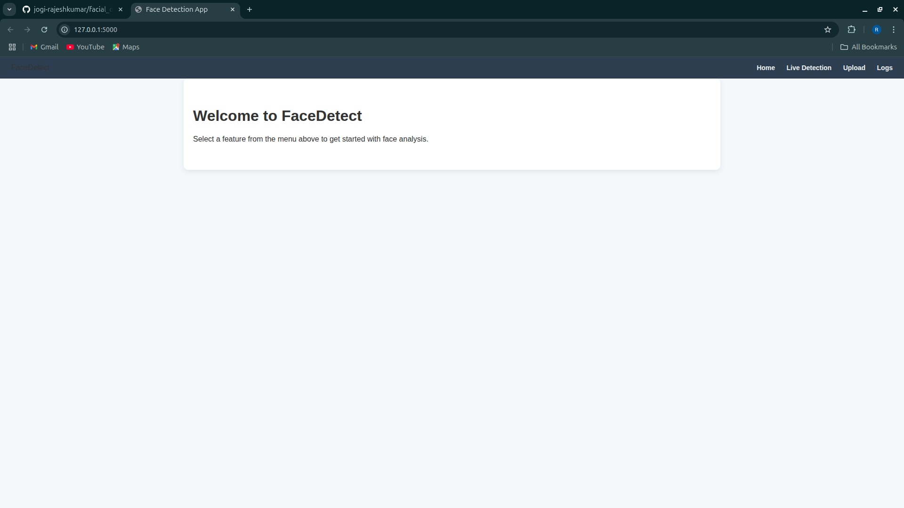
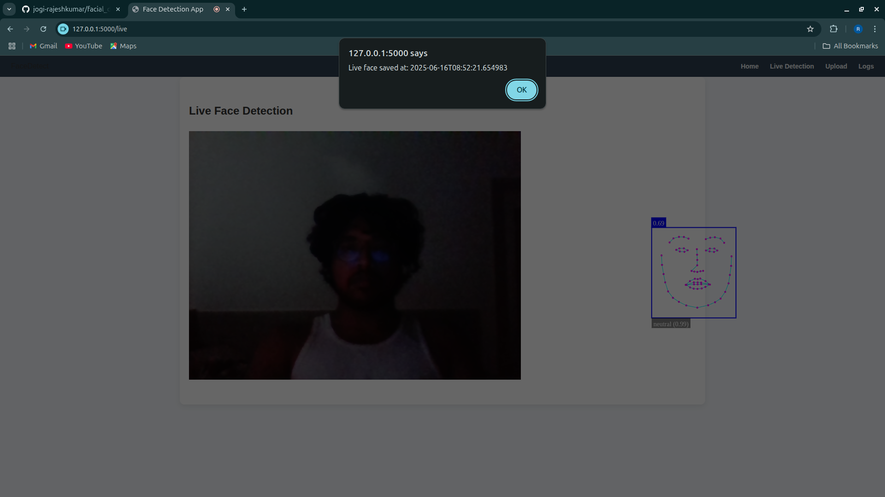
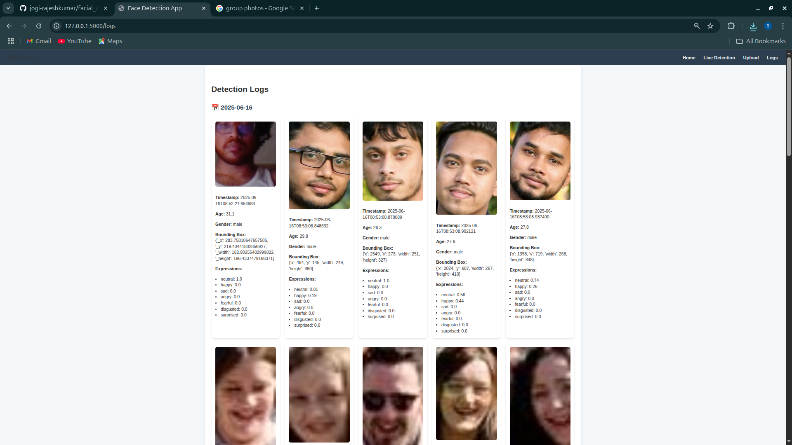
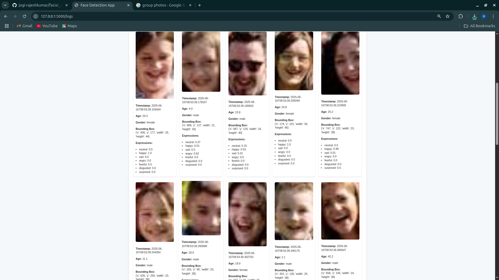

# 🧠 FaceDetect – Smart Face Detection Web App

FaceDetect is a full-stack web application that uses **face-api.js** to detect faces, estimate **age**, **gender**, and **emotions**, and logs these detections to a CSV file with cropped face images. Users can perform live detection using a webcam or upload static images. All results are saved and visualized via a log dashboard.

## 🌟 Features

- 🔴 **Live Face Detection** via webcam.
- 📤 **Image Upload Detection** with face cropping.
- 📊 Logs stored and displayed in a **day-wise grouped format** using card-based UI.
- 🧓 Estimates **age**, **gender**, and **expressions** like happy, sad, angry, etc.
- 📷 **Face thumbnails** are stored and displayed from detections.
- 🎨 Clean, responsive interface with modern styling and navigation bar.

## 🖼️ Screenshots

### 🏠 Home Page


### 🎥 Live Detection


### 🖼️ Upload Detection Interface


### 📷 Upload Result (Faces Detected & Cropped)


### 📊 Logs Page - Daywise View




---

## 🛠️ Technologies Used

- **Frontend**: HTML, CSS, JavaScript
- **JS Library**: [face-api.js](https://github.com/justadudewhohacks/face-api.js)
- **Backend**: Flask (Python)
- **Data Handling**: CSV for log storage
- **Image Processing**: HTML5 Canvas, base64 conversion

---

## 🚀 Getting Started

### 1. Clone the repository
```bash
git clone https://github.com/yourusername/facial_detection_app.git
cd facial_detection_app
```

### 2. Setup Python Environment
```bash
pip install flask
```

### 3. Download face-api.js models
Unzip the provided `models.zip` and place all model files into:
```
/static/models/
```

### 4. Run the app
```bash
python app.py
```

Visit `http://127.0.0.1:5000` in your browser.

---

## 📁 Project Structure

```
├── app.py
├── static/
│   ├── css/styles.css
│   ├── js/
│   │   ├── live.js
│   │   ├── upload.js
│   │   ├── logs.js
│   │   └── face-api.min.js
│   └── models/  # <- pretrained face-api.js models
├── templates/
│   ├── layout.html
│   ├── index.html
│   ├── upload.html
│   ├── live.html
│   └── logs.html
├── logs/
│   └── faces.csv
├── screenshots/
│   └── *.png
```

---

## ✍️ Author

**Rajesh Kumar Jogi**  
---

## 📝 License

This project is licensed under the MIT License – see the [LICENSE](LICENSE) file for details.
